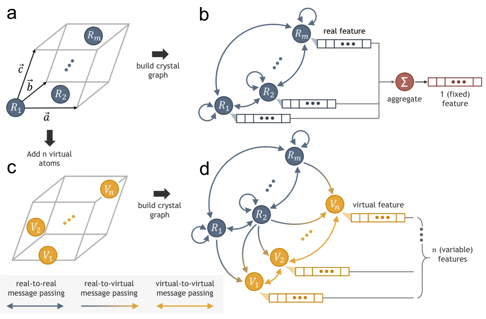

# Virtual Node Graph Neural Network for Full Phonon Prediction
We present the virtual node graph neural network (VGNN) to address the challenges in phonon prediction. 

<p align="center">
  
</p>

## [1] Set up env   
To work from a local copy of the code:

1. Clone the repository:
	> `git clone https://github.com/RyotaroOKabe/phonon_prediction.git`

	> `cd phonon_prediction_`

2. Create a virtual environment for the project:
	> `conda create -n pdos python=3.9`

	> `conda activate pdos`

3. Install all necessary packages:
	> `pip install -r requirements.txt -f https://pytorch-geometric.com/whl/torch-${TORCH}+${CUDA}.html`

	where `${TORCH}` and `${CUDA}` should be replaced by the specific CUDA version (e.g. `cpu`, `cu118`) and PyTorch version (e.g. `2.0.0`), respectively. For example:

	> `pip install -r requirements.txt -f https://pytorch-geometric.com/whl/torch-2.0.0+cu118.html`

4. Run `jupyter notebook` and open `VVN.ipynb` or `kMVN.ipynb`.

## [2] Tutorial   
You can go through the tutorial by rynning Jupyter notebooks: , `tutorial_VVN.ipynb`, `tutorial_MVN.ipynb`, `tutorial_kMVN.ipynb`. If you want to use the model you trained from scratch (see the section [4] below), Please specify `pretrained_name` in the codes.   
* The tutorial codes of the previous version (uses the code and model for generating figures on our manuscript) are stored in the folder `./previous_codes/`. You can move the files to the parent directory and run the jupyter notebooks `tutorial_XXX_previous.ipynb`.   

## [2] Use the pre-trained models to run phonon prediction of your target materials   
We provide the Jupyter notebooks to run phonon prediction of the materials you have: , `cif_VVN.ipynb`, `cif_MVN.ipynb`, `cif_kMVN.ipynb`. 
Please store your CIF files in the folder `./cif_folder/`. The Jupyter notebooks load materials in the folder and run prediction. You need to set `idx_out`, to specify which material to plot the result. 

## [4] Train the model
If you want to train the model fro scratch, Ruh the training codes.         
```
$ python train_vvn.py    
```
Train the MVN for Gamma phonon prediction.       
```
$ python train_mvn.py    

```
Train the $k$-MVN for phonon band structure prediction.   
```
$ python train_kmvn.py    

```
  

## Citation   
Please consider citing the following paper if you find our code & data useful.   

```
@article{okabe2024virtual,
  title={Virtual node graph neural network for full phonon prediction},
  author={Okabe, Ryotaro and Chotrattanapituk, Abhijatmedhi and Boonkird, Artittaya and Andrejevic, Nina and Fu, Xiang and Jaakkola, Tommi S and Song, Qichen and Nguyen, Thanh and Drucker, Nathan and Mu, Sai and others},
  journal={Nature Computational Science},
  pages={1--10},
  year={2024},
  publisher={Nature Publishing Group US New York}
}
```

## References
**Publication:** Zhantao Chen, Nina Andrejevic, *et al.* "Virtual Node Graph Neural Network for Full Phonon
Prediction." Adv. Sci. 8, 2004214 (2021). https://onlinelibrary.wiley.com/doi/10.1002/advs.202004214.    

**E(3)NN:** Mario Geiger, Tess Smidt, Alby M., Benjamin Kurt Miller, *et al.* Euclidean neural networks: e3nn (2020) v0.4.2. https://doi.org/10.5281/zenodo.5292912.

**Dataset:** Guido Petretto, Shyam Dwaraknath, Henrique P. C. Miranda, Donald Winston, *et al.* "High-throughput Density-Functional Perturbation Theory phonons for inorganic materials." (2018) figshare. Collection. https://doi.org/10.6084/m9.figshare.c.3938023.v1

### Data Availability Statement
The data that support the findings of this study are openly available in GitHub at https://github.com/RyotaroOKabe/phonon_prediction. The $\Gamma$-phonon database generated with the MVN method is available at https://osf.io/k5utb/ 

